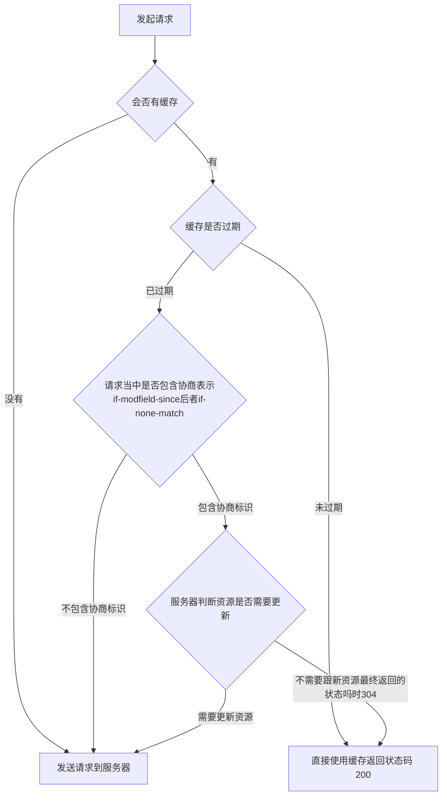

缓存就是把需要的文件保存下来，方便下次使用

# 缓存

> 缓存有好多种：
>
> 数据库缓存
>
> CDN 缓存
>
> 代理服务器缓存
>
> 浏览器缓存

## 浏览器缓存

浏览器缓存氛围强`缓存`、`协商缓存`。

### 强缓存

浏览器请求完成以后回根据，Response Header 信息判断是不是要进行强缓存，Response Header 里面有 这些字段则要进行强缓存：

+ expires - 一个时间戳 格林尼治时间 ，下次请求时时间小于这个时间就直接使用缓存，返回状态吗 200。
+ cache-contro 有很多种类
  + no-cache 不使用缓存。
  + no-store 不进行缓存。
  + max-age 最大保质期，数字， 单位是秒。
  + public 浏览器 和 服务器 都可以缓存。
  + private 只有浏览器可以缓存。
+ pragma http1.0 用来禁止页面缓存，no-cache 的时候不使用缓存。

### 协商缓存

> 协商缓存时在强缓存不生效的时候才开始作用，根据协商标识判断资源是否在服务器中更新。
>
> 协商标识：
>
> If-Modified-Since - 第一次请求返回头中包含 Last-Modified，第二次请求就会带上。
>
> If-None-Match - 第一次请求返回ETag，第二次请求会带上。
>
> ETag 时服务器生成的资源的唯一标识，直接判断唯一标识想不想等即可。
>
> Last-Modified 服务器资源最后修改时间，判断当前缓存资源最后修改时间和，服务器资源最后修改时间前后，是否需要更新资源。

### 缓存位置

+ Service-Worker Http
+ MemoryCache - 内存中存储，关闭Tab签就消失。空间小，速度快。
+ DiskCache - 硬盘中存储，时间长，空间大。
+ PushCache - 只在Session 中存在，会话结束被释放。
+ Preefetch cache(预取缓存) - 连接中的资源缓存。

